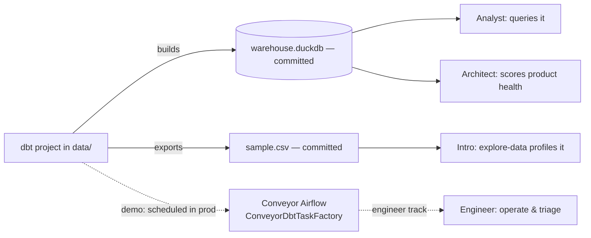

# AI Agent Skills for Data Practitioners — Design Outline

## The One Thing
> **Write an expert workflow once as a skill; fan it out with subagents when the work is parallel.**

Everything in the day ladders toward that sentence: *use* a skill → *inspect* why it triggers → *build* one → *fan it out*.

## Audience
Mixed data practitioners — **data engineers, data analysts/BI developers, data architects**. Not all comfortable in a terminal. Choose-your-own-adventure by role after a shared opener.

## The arc (use → inspect → build → fan out)
A single conceptual ladder, no "L1/L2" jargon. Progressive difficulty culminating in subagents, so everyone leaves knowing **how** and **when** to fan out.

## Timeline (3 hours)
| Time | Block | Who |
|---|---|---|
| 0:00–0:30 | Use `explore-data` on the sample data, then look inside it (anatomy, why `description` triggers) | everyone |
| 0:30–1:30 | Build your track's skill (scaffolded skeleton) | by track |
| 1:30–2:00 | 🍽️ Food | |
| 2:00–3:00 | Add subagents — a skill that fans out, often *calling* the build-block skill | by track |

The food break is the structural seam: the build half must reach a clean, runnable checkpoint by 1:30 even for a slower participant.

## Tracks
| Role | Build (0:30–1:30) | Subagent finale (2:00–3:00) |
|---|---|---|
| ⚙️ Data Engineer | **Airflow Ops** — schedule the dbt→DuckDB build on Conveyor Airflow (`ConveyorDbtTaskFactory`), operate the pipeline via the Astronomer Airflow skill | **Failure triage** — a subagent per failed DAG diagnoses root cause in parallel → one incident summary |
| 📊 Analyst / BI Developer | **Talk to your data** — NL→SQL against the shared DuckDB | **Multi-panel report** — a subagent per section queries independently → one assembled report |
| 🏗️ Data Architect | **Data Product Checkup** — wrap `checkup`/`checkup-dbt` to score one data product on DuckDB | **Portfolio health** — fan out `checkup` across *all* data products → one governance scorecard |

## The shared dataset (narrative spine)

Truth lives in the **committed** `warehouse.duckdb` + `sample.csv`. The engineer's Conveyor run is a **demonstration** of production scheduling — DuckDB is local, so the cloud run doesn't physically produce the shared file. "Poetic" continuity, chosen over an S3 round-trip to protect the time budget.

## The subagent lesson (when, not just how)
- Intro profiled **one** CSV single-pass → no subagents.
- Each finale hits **many** independent units (failed DAGs / report sections / data products) → fan out, then synthesize.
- Heuristic: *independent + parallelizable + context-heavy → subagents; quick single-pass → don't* (latency, tokens, coordination cost).
- Finales **compose** the build skill (call it) rather than merely extending it.

## Platform
Pick a surface: **VSCode Claude Code extension** (terminal-averse) or **Claude Code CLI**. Same skills, same execution. (OpenWebUI was considered and dropped — its instructions-only skill model added a confusing portability caveat.)

## Key design decisions (and the rejected alternatives)
1. **Shared intro, role tracks, no reconverge.** Subagent finale is per-track scaffolded hands-on, *not* a shared capstone.
2. **`explore-data` as the universal opener**, replacing the Airflow warm-up — which assumed Airflow literacy a mixed room lacks. Airflow demoted into the engineer track.
3. **Dropped the PM track** (weakest "feel it in 30 min" hook) and **draw.io** (platform architecture, not data architecture).
4. **Take-home extras**, not in-room: PR Review, Benchmark, Anti-Skill (Swill).

## Facilitation & risk mitigations
- **Two facilitators** float across three tracks; bias coverage to the thinnest/most-stuck track during the subagent hour.
- **Solutions available** as a rip-cord — finishing-by-peeking beats stuck-and-silent.
- **Pre-bake the Conveyor IDE image**: `explore-data`, the committed DuckDB/CSV, the deployed engineer demo. Intro starts on "run it," not "install it."
- Participants still **learn to install a skill** as the first, low-stakes step of their track.
- Conveyor is robust → no pre-recorded fallback deemed necessary.

## Pre-workshop verification (carry-over)
- Live-test the Astronomer Airflow skill against a real Conveyor env (token refresh through the proxy; Airflow 2.x `api/v1` vs 3.x path).
- Confirm `checkup` + `checkup-dbt` run against a DuckDB-backed dbt project.
- Confirm `ConveyorDbtTaskFactory` usage for the engineer demo.
